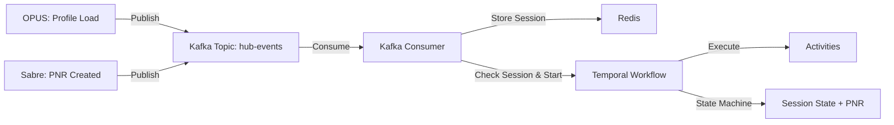

# BPM POC - Business Process Management with Temporal & Kafka

This project demonstrates a BPM solution using Temporal.io for workflow orchestration, Kafka for event streaming, and Redis for session management.

## Architecture



## Prerequisites

- Docker & Docker Compose
- Java 17
- Gradle

## Infrastructure Components

| Service | Port | Purpose |
|---------|------|---------|
| Kafka | 9094 | Event streaming |
| Zookeeper | 2181 | Kafka coordination |
| Redis | 6379 | Session storage |
| Temporal Server | 7233 | Workflow orchestration |
| Temporal UI | 8081 | Web interface |
| PostgreSQL | 5432 | Temporal persistence |

## Quick Start

### 1. Start Infrastructure

```bash
docker-compose up -d
```

Verify all containers are running:
```bash
docker-compose ps
```

### 2. Start Temporal Worker

In a new terminal:
```bash
export JAVA_HOME=/opt/homebrew/opt/openjdk@17
./gradlew runWorker
```

Expected output: `Worker started. Listening on hub-events-queue`

### 3. Start Kafka Consumer

In another terminal:
```bash
export JAVA_HOME=/opt/homebrew/opt/openjdk@17
./gradlew runConsumer
```

Expected output: `Kafka consumer started...`

## Event Structure

All events published to Kafka follow this structure:

```json
{
  "type": "hubevent",
  "agentid": "agent-007",
  "cardMemberNumber": "375987654321001",
  "source": "opus" | "sabre",
  "pnr": "PNR123456",
  "timestamp": "2025-11-20T18:00:00Z"
}
```

## Event Processing Flow

### Event Type 1: OPUS Profile Load (`source: opus`)
When an agent loads a Card Member profile in OPUS:

1. **Action**: Creates/updates session in Redis
2. **Key**: `session:{agentid}:{cardMemberNumber}`
3. **TTL**: 1 hour
4. **Workflow**: No workflow started (session only)

```bash
./gradlew runProducer --args="opus"
```

**Expected Output**:
```
Session created/updated in Redis: session:agent-007:375987654321001
```

### Event Type 2: Sabre PNR Creation (`source: sabre`)
When an agent creates a PNR in Sabre:

1. **Check**: Looks for active session in Redis
2. **If Session Exists**: 
   - Starts Temporal workflow
   - Stores PNR in workflow state
   - Executes activities (logging, CRM notification)
3. **If No Session**: 
   - **ERROR**: Logs error message
   - Asks agent to load Card Member in OPUS first

```bash
./gradlew runProducer --args="sabre PNR123456"
```

**Expected Output (with session)**:
```
Session exists in Redis. Starting/Signaling workflow.
Signaled/Started workflow session-agent-007-375987654321001
[Workflow] PNR found in event: PNR123456
[Activity] Notifying CRM about PNR: PNR123456
```

**Expected Output (without session)**:
```
ERROR: Sabre event received but no active session found for session:agent-007:375987654321001
ACTION REQUIRED: Please load Card Member profile in OPUS for better experience.
```

## Testing Scenarios

### Scenario 1: PNR Without Session (Error Case)

```bash
# Clear Redis first
docker exec -it bpm-poc-redis-1 redis-cli FLUSHALL

# Send Sabre PNR event without OPUS session
./gradlew runProducer --args="sabre ABC123"
```

**Expected**: Error message asking to load profile in OPUS

### Scenario 2: Complete Flow (Happy Path)

```bash
# Step 1: Agent loads Card Member in OPUS
./gradlew runProducer --args="opus"

# Step 2: Agent creates PNR in Sabre
./gradlew runProducer --args="sabre XYZ789"
```

**Expected**:
1. Session created in Redis
2. Workflow started
3. PNR stored in workflow state
4. CRM notified

### Scenario 3: Multiple PNRs in Same Session

```bash
# Create session
./gradlew runProducer --args="opus"

# Create first PNR
./gradlew runProducer --args="sabre PNR001"

# Create second PNR (updates workflow state)
./gradlew runProducer --args="sabre PNR002"
```

**Expected**: Workflow state updated with latest PNR (PNR002)

### Scenario 4: Verify in Temporal UI

1. Open http://localhost:8081
2. Navigate to **Workflows**
3. Look for workflow ID: `session-agent-007-375987654321001`
4. Click to view:
   - Execution history
   - Workflow state (including PNR)
   - Event list

## Workflow State

The workflow maintains the following state:

```java
{
  "sessionId": "agent-007-375987654321001",
  "agentid": "agent-007",
  "cardMemberNumber": "375987654321001",
  "pnr": "PNR123456",              // ← Stored when Sabre event arrives
  "events": [...],                  // All events received
  "status": "ACTIVE",
  "lastUpdated": "2025-11-20T18:00:00Z"
}
```

## Verification Commands

### Check Redis Session

```bash
docker exec -it bpm-poc-redis-1 redis-cli
> KEYS session:*
> GET session:agent-007:375987654321001
> TTL session:agent-007:375987654321001
> EXIT
```

### Check Kafka Topic

```bash
docker exec -it bpm-poc-kafka-1 kafka-console-consumer \
  --bootstrap-server localhost:29092 \
  --topic hub-events \
  --from-beginning
```

### View Logs

```bash
# Worker logs
# (Check terminal where runWorker is running)

# Consumer logs
# (Check terminal where runConsumer is running)

# Infrastructure logs
docker-compose logs -f temporal
docker-compose logs -f kafka
docker-compose logs -f redis
```

## Project Structure

```
bpm-poc/
├── docker-compose.yml                    # Infrastructure setup
├── build.gradle                          # Gradle dependencies
├── src/main/java/com/example/bpm/
│   ├── model/
│   │   ├── HubEvent.java                 # Event POJO (type, agentid, source, pnr)
│   │   └── SessionState.java            # State POJO (includes PNR)
│   ├── SessionWorkflow.java             # Workflow interface
│   ├── SessionWorkflowImpl.java         # Workflow implementation
│   ├── SessionActivities.java           # Activities interface
│   ├── SessionActivitiesImpl.java       # Activities implementation
│   ├── BpmWorker.java                   # Temporal worker
│   ├── KafkaConsumerApp.java            # Kafka consumer with Redis
│   └── KafkaProducerApp.java            # Test event producer
└── README.md
```

## Key Features

1. **Session-based Workflow Triggering**: Workflows only start when a valid OPUS session exists in Redis
2. **Event-driven Architecture**: Kafka provides decoupled event streaming
3. **PNR State Management**: PNR is tracked in workflow state for the entire session
4. **Error Handling**: Clear error messages when Sabre events arrive without OPUS session
5. **Durable Execution**: Workflows survive process restarts
6. **Temporal Visibility**: Full execution history in Temporal UI

## Real-World Use Cases

### Use Case 1: Agent Workflow Tracking
- Agent loads Card Member in OPUS → Session created
- Agent creates PNR in Sabre → Workflow tracks the booking process
- System maintains complete audit trail of agent actions

### Use Case 2: Multi-Tab Support
- Agent can load multiple Card Members in different browser tabs
- Each creates a separate session in Redis
- Each Sabre PNR event is matched to correct session

### Use Case 3: Session Expiry
- Sessions expire after 1 hour (TTL in Redis)
- If agent creates PNR after expiry → Error message
- Encourages agents to reload profile for better experience

## Troubleshooting

### Kafka Connection Issues
```bash
# Restart Kafka
docker-compose restart kafka
# Wait 10-15 seconds for startup
```

### Redis Connection Issues
```bash
docker-compose restart redis
```

### Temporal Connection Issues
```bash
docker-compose restart temporal
# Check logs
docker-compose logs temporal | grep -i error
```

### Clean Restart
```bash
docker-compose down -v
docker-compose up -d
```

## Components Explained

### Temporal Server vs Worker

**Temporal Server** (`temporalio/auto-setup` in Docker):
- The orchestration engine
- Stores workflow state
- Manages task queues
- Provides UI

**Worker** (`./gradlew runWorker`):
- Executes your Java code
- Polls Temporal Server for tasks
- Runs workflows and activities

**Both must be running** for workflows to execute.

### Workflows vs Activities

**Workflows** (`SessionWorkflowImpl`):
- Orchestration logic
- Maintains state (session, PNR, events)
- Makes decisions
- Durable and deterministic

**Activities** (`SessionActivitiesImpl`):
- Actual work with side effects
- Calls external services (CRM, databases)
- Can fail and retry independently

## Next Steps

- Add more event types (booking confirmed, payment processed)
- Implement workflow timeout handling
- Add comprehensive error handling and retry policies
- Create unit and integration tests
- Add monitoring and observability
- Implement workflow versioning strategy
- Add support for multiple PNRs per session